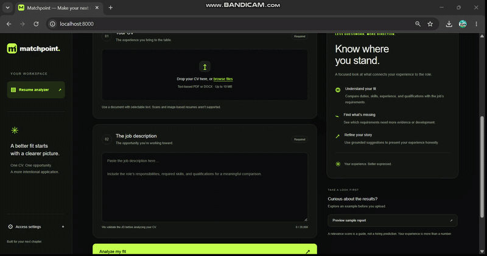

# Matchpoint — AI-Based Resume Analyzer

**Understand how your CV addresses a job description—and see the evidence behind every assessment.**

Matchpoint is a full-stack resume analysis application for candidates who want to tailor their CV to a specific role. Upload a text-based PDF or DOCX, provide a job description, and explore a requirements coverage score, source-linked evidence, improvement suggestions, and a downloadable PDF report.

## Product demo



NOTE: [▶ Watch the full Matchpoint demo here](./matchpoint-demo-video.mp4)

The linked MP4 is included in this repository. Open it to view or download the walkthrough.

## The problem

A CV may describe a capable candidate without clearly demonstrating the qualifications a particular role asks for. Generic keyword counts and unexplained scores make it difficult to understand what needs improvement. Candidates need to know which requirements their CV supports, where the evidence appears, and what remains unclear.

Matchpoint makes that comparison inspectable. It derives criteria from the submitted job description and evaluates the CV against those criteria. The approach is designed for different professions, including nontechnical roles, rather than using a software-specific skill list as the scoring authority. Accuracy across every profession and language has not been established.

## What you can do

- **Compare against a required JD:** placeholders and unrelated text are rejected before a new CV analysis starts.
- **Inspect each assessment:** view the requirement, its exact JD excerpt, verified CV excerpts, source locations, status, and explanation.
- **Understand the score:** required-criteria coverage has an explicit formula; preferred criteria appear separately.
- **Explore every identified gap:** start with six suggestions, then use **Show 6 more** or **Show all** without another model call.
- **Download a readable PDF:** export the summary, numbered evidence entries, all suggestions, and assessment rubric.
- **Repeat a saved comparison consistently:** identical inputs and pipeline configuration reuse the persisted result.
- **Use a responsive interface:** vanilla HTML, CSS, and JavaScript with black and neon-green styling, light/dark themes, and a sample report preview.

## How the assessment works

```text
CV + job description
        |
Authentication and request limits
        |
Saved comparison lookup ---- existing result ---> return saved report
        |
Validate JD and extract source-backed criteria
        |
Extract document text and structured CV fields
        |
Assess each criterion against CV evidence
        |
Calculate coverage and create all gap suggestions
        |
Save canonical result in SQLite
        |
Interactive insights + PDF export
```

### Scoring criteria

```text
Required coverage (%) = supported required criteria / total required criteria × 100
```

For example, six supported requirements out of ten produce **60% coverage**. All required criteria have equal weight. Partial evidence receives no supported credit; preferred qualifications cannot compensate for an unsupported required criterion. When no required criteria exist, coverage is unavailable.

| Status              | Meaning                                                                                                   |
| ------------------- | --------------------------------------------------------------------------------------------------------- |
| Supported           | CV evidence explicitly addresses all material parts of the requirement.                                   |
| Partially supported | Evidence addresses only part of the requirement or falls short of its scope or threshold.                 |
| Mentioned only      | A capability is named without the requested supporting experience or qualification.                       |
| Not evidenced       | No supporting CV passage was identified; this does not establish that the candidate lacks the capability. |
| Unclear             | Evidence is ambiguous, missing from the assessment, or cannot be verified against the source.             |

This is an **application-defined document coverage measure**, not an industry-certified ATS score, hiring probability, or independent verification of a candidate's competence.

### Evidence and repeatability

Requirements come from JD quotations. Returned evidence is checked against the original text, allowing whitespace normalization. Invalid quotations are rejected; listing-only evidence cannot receive supported credit. Suggestions use requirement text and fixed guidance, rather than inventing candidate achievements or metrics.

These checks constrain fabrication but do not guarantee correct interpretation or exhaustive extraction. Model judgments still need user review. Assessment runs in batches of ten criteria, with a maximum of 100 criteria.

The complete first successfully saved result is reused for the same CV bytes, file type, normalized JD, pipeline version, and model settings. This survives restarts and preserves scores and suggestion IDs. Changed inputs/configuration or deletion of stored results can trigger fresh model output that differs. Renaming an otherwise identical upload can return the original saved filename.

## Core technical stack

| Layer                | Technology                                                       | Role                                                                   |
| -------------------- | ---------------------------------------------------------------- | ---------------------------------------------------------------------- |
| Backend              | Python, FastAPI, Uvicorn                                         | API routes, validation, static frontend serving, application lifecycle |
| Frontend             | HTML, CSS, vanilla JavaScript                                    | Responsive workspace, themes, insights, uploads, PDF downloads         |
| AI integration       | LangChain Core, LangChain OpenAI                                 | Prompt composition and structured model responses                      |
| Data schemas         | Pydantic                                                         | Validate extracted CV fields, JD criteria, and evidence assessments    |
| Document handling    | PyMuPDF, pdfplumber, python-docx, lxml                           | PDF/DOCX extraction and document validation                            |
| PDF export           | PyMuPDF                                                          | Paginated reports with consistent print styling                        |
| Persistence          | SQLite via Python's sqlite3                                      | Sessions, suggestions, and canonical analysis responses                |
| Supporting libraries | AnyIO, python-dateutil, python-dotenv                            | Worker execution, date parsing, environment configuration              |
| Optional tracing     | LangSmith                                                        | Instrumented model workflows; tracing is disabled by default           |
| Testing              | unittest, HTTPX/FastAPI TestClient; Node.js browser smoke script | Offline backend tests and browser integration checks                   |

No frontend bundler, npm dependency installation, vector database, or OCR engine is required.

## Installation

### Prerequisites

- **Python 3.13** (the tested version) and pip.
- Git, or a downloaded copy of this repository.
- An OpenAI API key and access to a model compatible with the application's structured-output requests.
- Node.js 22+ and Chrome/Edge only if running the optional browser checks.

Download this repository or clone it using its GitHub clone URL, then open a terminal in the project root—the directory containing `app.py`.

### Windows PowerShell

```powershell
python -m venv .venv
.\.venv\Scripts\python.exe -m pip install -r requirements.txt
Copy-Item .env.example .env
```

### macOS / Linux

```bash
python3 -m venv .venv
.venv/bin/python -m pip install -r requirements.txt
cp .env.example .env
```

The commands use the virtual environment directly, so activation is optional. Only copy `.env.example` for a new setup; preserve an existing `.env`. Dependency versions are pinned in `requirements.txt`. Windows is the tested development environment; the POSIX commands are equivalent setup instructions.

### Configure environment variables

Edit `.env` locally:

```dotenv
OPENAI_API_KEY=your-provider-api-key
RESUME_PARSER_MODEL=your-supported-model-id
ATS_API_KEY=your-random-application-secret-at-least-32-characters
REASONING_EFFORT=
DATABASE_PATH=sessions.db
LANGSMITH_TRACING=false
LANGCHAIN_TRACING_V2=false
```

| Variable              | Purpose                                                                                       |
| --------------------- | --------------------------------------------------------------------------------------------- |
| `OPENAI_API_KEY`      | Server-side provider credential used for model calls.                                         |
| `RESUME_PARSER_MODEL` | Model ID used by the analysis pipeline; structured output must be supported.                  |
| `ATS_API_KEY`         | Application access secret, at least 32 characters; sent by clients as `X-API-Key`.            |
| `REASONING_EFFORT`    | Optional; leave blank unless the configured model supports it.                                |
| `DATABASE_PATH`       | SQLite location; relative paths resolve beside `db.py`. The parent directory must exist.      |
| Tracing variables     | Leave false unless intentionally enabling tracing of potentially sensitive document contents. |

Generate the application secret with:

```powershell
.\.venv\Scripts\python.exe -c "import secrets; print(secrets.token_urlsafe(32))"
```

On macOS/Linux, substitute `.venv/bin/python`. Paste the generated value into `ATS_API_KEY`. **The application key and provider key serve different purposes; never enter the provider key in the browser.** Model requests require your own provider access and may incur charges.

## Run locally

Windows:

```powershell
.\.venv\Scripts\python.exe -m uvicorn app:app --host 127.0.0.1 --port 8000
```

macOS/Linux:

```bash
.venv/bin/python -m uvicorn app:app --host 127.0.0.1 --port 8000
```

Open **http://127.0.0.1:8000/**. FastAPI serves both the frontend and API; do not open `frontend/index.html` directly. The database initializes automatically at startup. Restart the server after changing environment configuration.

1. Open **Access settings** and enter your `ATS_API_KEY`.
2. Upload a text-based PDF or DOCX CV and paste a real job description.
3. Choose **Analyze my fit**.
4. Review coverage and open **Insights** to inspect evidence for each criterion.
5. Expand suggestions as needed and choose **Download PDF**.

The access key stays in tab memory and clears on refresh. Only the theme preference is stored in local storage. **Preview sample report** displays illustrative data without a model request; downloading its PDF still requires API access.

## API reference

Interactive documentation: **http://127.0.0.1:8000/docs**. Choose **Authorize** and enter the application key.

| Endpoint                  | Input                                    | Output                                                                               |
| ------------------------- | ---------------------------------------- | ------------------------------------------------------------------------------------ |
| `POST /api/v1/analyze`    | Multipart `file` and `job_description`   | JSON including `session_id`, `match_score`, `scorecard`, parsed data, and all `gaps` |
| `POST /api/v1/report/pdf` | JSON `{"session_id":"saved-session-id"}` | PDF generated from the server's saved report                                         |
| `POST /api/v1/report/pdf` | JSON `{"sample":true}`                   | Illustrative sample PDF                                                              |

All `/api/v1/` requests require `X-API-Key`. The PDF endpoint does not accept replacement scores or evidence from the browser. There is currently no suggestion-rating endpoint.

| Status | Typical cause                                                            |
| ------ | ------------------------------------------------------------------------ |
| 400    | Invalid, scanned, empty, or unsupported document                         |
| 401    | Missing or incorrect application key                                     |
| 404    | Saved report not found                                                   |
| 409    | Historical report uses the previous scoring format; run a new comparison |
| 413    | File, request, page, text, or archive limit exceeded                     |
| 422    | Missing JD, invalid fields, placeholder input, or non-JD text            |
| 429    | Request rate limit reached                                               |
| 503    | Capacity full, JD validation unavailable, or PDF export unavailable      |
| 500    | Analysis/storage failure; safe incident ID returned                      |

## Supported files and limits

Use selectable-text PDFs or DOCX files. Scanned/image-only PDFs, password-protected PDFs, blank PDF pages, and detected full-page scans with an OCR layer are rejected. An empty/image-only DOCX is also rejected. Small images such as a profile photo are allowed. Scan detection is a text/image-coverage heuristic, not proof of document authenticity.

| Limit                       | Default                                               |
| --------------------------- | ----------------------------------------------------- |
| CV upload / whole request   | 10 MB / 11 MB                                         |
| PDF pages                   | 20                                                    |
| Extracted CV text / JD text | 100,000 / 20,000 characters                           |
| Expanded DOCX archive       | 30 MB and 2,000 entries                               |
| Concurrent API requests     | 2 per process                                         |
| Request rate                | 10 per minute per shared application key, per process |
| Export length               | 200 pages                                             |

## Tests and development

Install development dependencies and run the offline Python suite:

```powershell
.\.venv\Scripts\python.exe -m pip install -r requirements-dev.txt
.\.venv\Scripts\python.exe -m unittest discover -s tests -t . -v
.\.venv\Scripts\python.exe -m pip check
```

On macOS/Linux, substitute `.venv/bin/python`. Tests use synthetic documents, temporary databases, and mocked model calls; they do not establish live-model accuracy or require paid model requests.

Optional browser integration checks on Windows:

```powershell
node tests/frontend_smoke.cjs
```

The browser script currently expects `.venv/Scripts/python.exe`. It uses Node.js 22+ and installed Chrome/Edge, with no npm packages. Set `BROWSER_PATH` if the browser is elsewhere. Screenshots and downloads go into ignored `.artifacts/`.

## Repository guide

```text
app.py                    FastAPI routes, authentication, limits, orchestration
config.py                 Environment loading and cached model client
parser.py                 PDF/DOCX extraction and structured CV parsing
jd.py                     JD validation and requirement extraction
scorecard.py              Evidence assessment, rubric, coverage, suggestions
matcher.py                Assembles the comparison response
skills.py                 Source-backed skill display normalization
reproducibility.py        Comparison identity and computation locks
db.py                     SQLite storage and canonical saved results
reports.py                PDF generation
errors.py                 Shared input/error types
frontend/                 HTML, CSS, JavaScript, synthetic sample report
tests/                    Backend and browser regression checks
.env.example              Configuration template without credentials
requirements*.txt         Runtime and development dependencies
matchpoint-demo-video.mp4  Product walkthrough
```

## Data handling and deployment status

CV text is sent to the configured model provider. SQLite stores complete analysis responses, including extracted text and personal details, for replay and PDF export. Temporary upload files are cleaned up after processing; saved reports remain in the database. Keep `.env`, databases, and personal report artifacts out of Git.

The current app supports local use and controlled shared-key workspaces. It does **not** implement individual accounts or per-user report ownership: a key holder with a session ID can retrieve that report. A public multi-user launch still needs user authentication, ownership checks, retention/deletion controls, HTTPS, shared deployment-wide limits, and reviewed accuracy evaluations across intended professions and languages. Current admission limits are per process; use one worker for the documented limits.

## Troubleshooting

- **401 despite a key in `.env`:** `.env` configures the server; enter the same `ATS_API_KEY` in Access settings or Swagger Authorize so the client sends the header. Restart after changing it.
- **Startup configuration error:** check the three required variables and the application secret length.
- **Model/provider failure:** verify credentials, model access, structured-output compatibility, and any optional reasoning setting.
- **Scan rejected:** export the original document as a text-based PDF or upload its DOCX version.
- **Frontend does not connect:** use the FastAPI URL rather than opening the HTML file directly.
- **Database cannot open:** check that the configured parent directory exists and is writable.

## Project notes

[Product requirements](./PRODUCT_REQUIREMENTS.md), [implementation notes](./IMPLEMENTATION_PLAN.md), and [frontend plan](./FRONTEND_PLAN.md) record design decisions. [Repository cleanup review](./REPOSITORY_REVIEW.md) lists local artifacts and unused imports to review before publishing.

No license file is currently included. Choose and add a license before presenting the repository as licensed for reuse.
